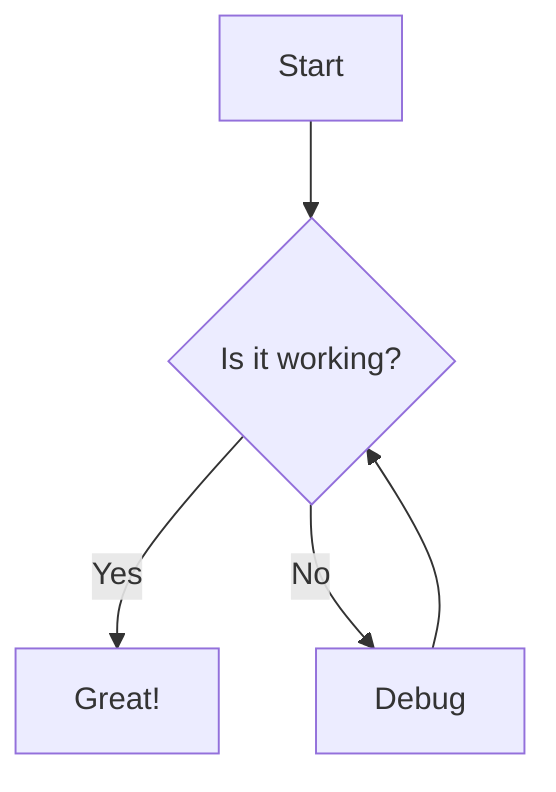
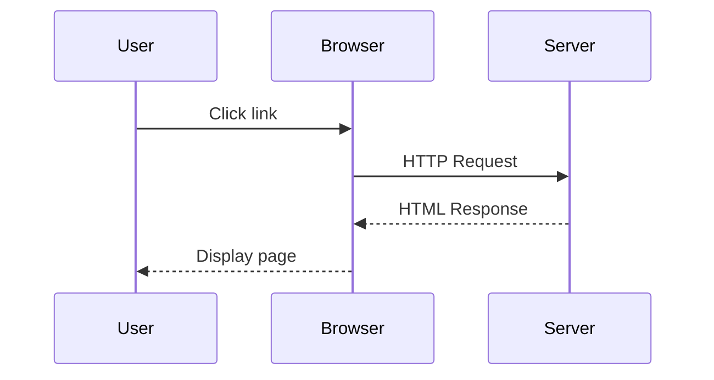

# Introduction

This is a **test document** to demonstrate the markdown to HTML converter with Mermaid support.

## Features

- GitHub-flavored Markdown
- Mermaid diagram rendering
- Dark/Light theme toggle
- YAML frontmatter support

## Mermaid Diagrams

### Flowchart



### Sequence Diagram



## Code Example

```javascript
function greet(name) {
    return `Hello, ${name}!`;
}
console.log(greet('World'));
```

## Conclusion

This converter produces standalone HTML files that render perfectly in any modern browser.
